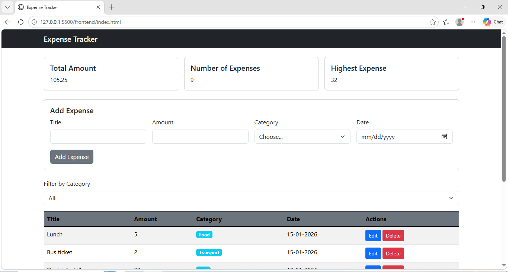
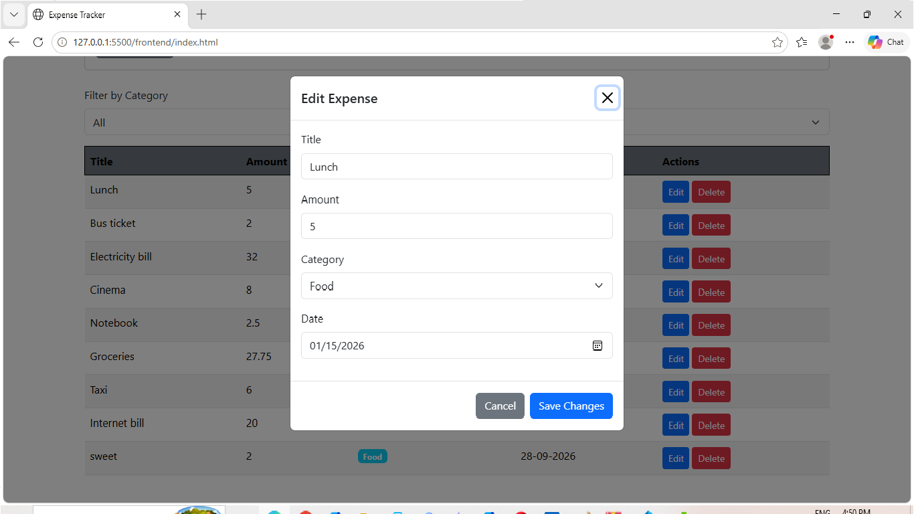

# Expense Tracker

A full-stack web application 
Users can add, edit, delete, and filter expenses, and view summary information such as the total amount, number of expenses, and highest expense.

## How to run

**Backend**

1. Open pgAdmin and create a database named:

   tracker_expense

2. Run the `schema.sql` file to create the `expenses` table.

3. Inside the `backend` folder, create a file named `.env` and add:

   DB_HOST=localhost  
   DB_PORT=5432  
   DB_USER=postgres  
   DB_PASSWORD=your_password  
   DB_NAME=tracker_expense

4. Open the terminal inside the `backend` folder and run:

   npm install

5. Start the backend server:

   node server.js

**Frontend**

1. Open the project in VS Code.

2. Make sure the backend server is running.

3. Open the `frontend` folder.

4. Open `index.html` using Live Server.

5. The page will open in the browser.

6. The frontend communicates with the backend API at:

   http://localhost:3000/api/expenses
## Features

- [x] Add an expense (with validation)
- [x] Delete an expense
- [x] Edit an expense
- [x] Filter by category
- [x] Summary cards (total, count, highest)
- [x] Data is saved in a PostgreSQL database

## Screenshots

## What was the hardest part?

The hardest part was running the project again after removing the `.env` file and `node_modules`.

I solved it by reinstalling the packages using `npm install`, recreating the `.env` file locally, and starting the backend server again.

Another difficult part was connecting the frontend to the API because the expenses were not appearing at first.
I solved it by checking the API URL, making sure the backend was running, and testing the API response until the data appeared correctly.
  
  ## video Link 
  https://drive.google.com/file/d/1atZMUMQjwCPtMZmsxUR8BAQCtump3bB1/view?usp=sharing